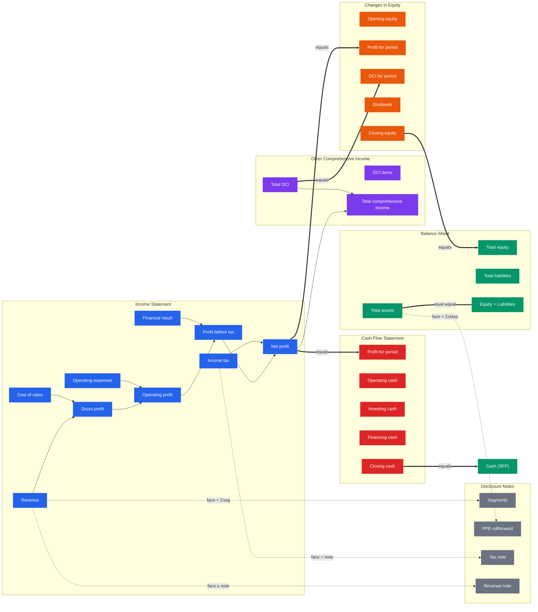

# FULL Reporting Hierarchy

```mermaid
graph LR
    classDef pnl fill:#2563eb,color:white,stroke:none
    classDef sfp fill:#059669,color:white,stroke:none
    classDef oci fill:#7c3aed,color:white,stroke:none
    classDef cfs fill:#dc2626,color:white,stroke:none
    classDef socie fill:#ea580c,color:white,stroke:none
    classDef check fill:#f59e0b,color:black,stroke:none
    classDef disc fill:#6b7280,color:white,stroke:none

    subgraph PNL[Income Statement]
        REV["Revenue"]:::pnl
        COGS["Cost of sales"]:::pnl
        GP["Gross profit"]:::pnl
        OPEX["Operating expenses"]:::pnl
        EBIT["Operating profit"]:::pnl
        FIN["Financial result"]:::pnl
        PBT["Profit before tax"]:::pnl
        TAX["Income tax"]:::pnl
        NP["Net profit"]:::pnl
    end

    subgraph OCI[Other Comprehensive Income]
        OCI_ITEMS["OCI items"]:::oci
        TOTAL_OCI["Total OCI"]:::oci
        TCI["Total comprehensive income"]:::oci
    end

    subgraph SOCIE[Changes in Equity]
        SOCIE_OPEN["Opening equity"]:::socie
        SOCIE_PROFIT["Profit for period"]:::socie
        SOCIE_OCI["OCI for period"]:::socie
        SOCIE_DIV["Dividends"]:::socie
        SOCIE_CLOSE["Closing equity"]:::socie
    end

    subgraph SFP[Balance Sheet]
        ASSETS["Total assets"]:::sfp
        EQUITY["Total equity"]:::sfp
        LIAB["Total liabilities"]:::sfp
        EQ_LIAB["Equity + Liabilities"]:::sfp
    end

    subgraph CFS[Cash Flow Statement]
        CFS_PROFIT["Profit for period"]:::cfs
        CFS_OPS["Operating cash"]:::cfs
        CFS_INV["Investing cash"]:::cfs
        CFS_FIN["Financing cash"]:::cfs
        CFS_CLOSE["Closing cash"]:::cfs
    end

    subgraph DISC[Disclosure Notes]
        DISC_SEG["Segments"]:::disc
        DISC_PPE["PPE rollforward"]:::disc
        DISC_TAX["Tax note"]:::disc
        DISC_REV["Revenue note"]:::disc
    end

    %% Summation trees (within statements)
    REV --> GP
    COGS --> GP
    GP --> EBIT
    OPEX --> EBIT
    EBIT --> PBT
    FIN --> PBT
    PBT --> NP
    TAX --> NP
    NP --> TCI
    TOTAL_OCI --> TCI
    ASSETS ===|must equal| EQ_LIAB

    %% Cross-statement ties
    NP ==>|"equals"| SOCIE_PROFIT
    TOTAL_OCI ==>|"equals"| SOCIE_OCI
    SOCIE_CLOSE ==>|"equals"| EQUITY
    CFS_CLOSE ==>|"equals"| SFP_CASH
    NP ==>|"equals"| CFS_PROFIT

    SFP_CASH["Cash (SFP)"]:::sfp

    %% Note-to-face ties
    REV -.->|"face ≥ note"| DISC_REV
    REV -.->|"face = Σseg"| DISC_SEG
    TAX -.->|"face = note"| DISC_TAX
    ASSETS -.->|"face = Σclass"| DISC_PPE
```
