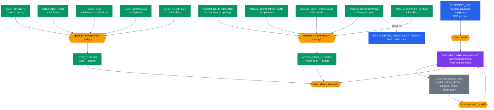

# PPE Reporting Hierarchy

```mermaid
graph TD
    classDef face fill:#2563eb,color:white,stroke:none
    classDef note fill:#7c3aed,color:white,stroke:none
    classDef roll fill:#059669,color:white,stroke:none
    classDef check fill:#f59e0b,color:black,stroke:none,stroke-dasharray:5
    classDef axis fill:#6b7280,color:white,stroke:none

    %% Primary statement
    SFP_PPE["FS.SFP.PPE_NET<br/>Property, plant and equipment<br/><i>SFP face line</i>"]:::face

    %% Checks
    CHK_FACE_NOTE{{"note = face?"}}:::check
    CHK_DISAGG{{"SUM(classes) = total?"}}:::check
    CHK_ROLL_COST{{"opening + movements = closing?"}}:::check
    CHK_ROLL_DEPR{{"opening + movements = closing?"}}:::check
    CHK_NET{{"cost − depr = carrying?"}}:::check

    %% Note total
    PPE_CARRYING["DISC.PPE.CARRYING_AMOUNT<br/>Carrying amount (net)<br/><i>Note total per class</i>"]:::note

    %% PPE classes (axis)
    AXIS["AXIS.PPE_CLASS_DOC<br/>Land & buildings | Plant | Fixtures | Under construction"]:::axis

    %% Rollforward — Cost
    COST_OPEN["COST_OPENING<br/>Cost — opening"]:::roll
    COST_ADD["COST_ADDITIONS<br/>+ Additions"]:::roll
    COST_BCA["COST_BCA<br/>+ Business combinations"]:::roll
    COST_DISP["COST_DISPOSALS<br/>− Disposals"]:::roll
    COST_FX["COST_FX_EFFECT<br/>± FX effect"]:::roll
    COST_CLOSE["COST_CLOSING<br/>Cost — closing"]:::roll

    %% Rollforward — Accumulated depreciation
    DEPR_OPEN["ACCUM_DEPR_OPENING<br/>Accum depr — opening"]:::roll
    DEPR_CHG["ACCUM_DEPR_CHARGE<br/>+ Charge for year"]:::roll
    DEPR_IMP["ACCUM_DEPR_IMPAIRMENT<br/>+ Impairment"]:::roll
    DEPR_DISP["ACCUM_DEPR_DISPOSALS<br/>− Disposals"]:::roll
    DEPR_FX["ACCUM_DEPR_FX_EFFECT<br/>± FX effect"]:::roll
    DEPR_CLOSE["ACCUM_DEPR_CLOSING<br/>Accum depr — closing"]:::roll

    %% PNL cross-reference
    PNL_DA["FS.PNL.DEPRECIATION_AMORTISATION<br/>D&A on PNL face"]:::face

    %% Edges
    SFP_PPE --> CHK_FACE_NOTE --> PPE_CARRYING
    PPE_CARRYING --> AXIS
    AXIS --> CHK_DISAGG
    CHK_DISAGG --> PPE_CARRYING

    PPE_CARRYING --> CHK_NET
    COST_CLOSE --> CHK_NET
    DEPR_CLOSE --> CHK_NET

    COST_OPEN --> CHK_ROLL_COST
    COST_ADD --> CHK_ROLL_COST
    COST_BCA --> CHK_ROLL_COST
    COST_DISP --> CHK_ROLL_COST
    COST_FX --> CHK_ROLL_COST
    CHK_ROLL_COST --> COST_CLOSE

    DEPR_OPEN --> CHK_ROLL_DEPR
    DEPR_CHG --> CHK_ROLL_DEPR
    DEPR_IMP --> CHK_ROLL_DEPR
    DEPR_DISP --> CHK_ROLL_DEPR
    DEPR_FX --> CHK_ROLL_DEPR
    CHK_ROLL_DEPR --> DEPR_CLOSE

    DEPR_CHG -.->|cross-ref| PNL_DA
```
