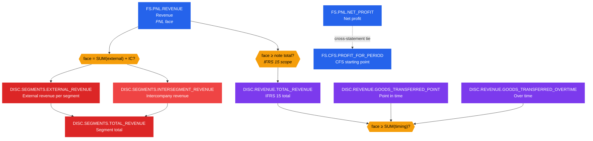

# REVENUE Reporting Hierarchy

```mermaid
graph TD
    classDef face fill:#2563eb,color:white,stroke:none
    classDef note fill:#7c3aed,color:white,stroke:none
    classDef seg fill:#dc2626,color:white,stroke:none
    classDef check fill:#f59e0b,color:black,stroke:none
    classDef ic fill:#ef4444,color:white,stroke:none

    PNL_REV["FS.PNL.REVENUE<br/>Revenue<br/><i>PNL face</i>"]:::face

    %% Segment disaggregation
    CHK_SEG{{"face = SUM(external) + IC?"}}:::check
    SEG_EXT["DISC.SEGMENTS.EXTERNAL_REVENUE<br/>External revenue per segment"]:::seg
    SEG_IC["DISC.SEGMENTS.INTERSEGMENT_REVENUE<br/>Intercompany revenue"]:::ic
    SEG_TOTAL["DISC.SEGMENTS.TOTAL_REVENUE<br/>Segment total"]:::seg

    %% IFRS 15 disaggregation
    CHK_TIMING{{"face ≥ SUM(timing)?"}}:::check
    REV_POINT["DISC.REVENUE.GOODS_TRANSFERRED_POINT<br/>Point in time"]:::note
    REV_OVER["DISC.REVENUE.GOODS_TRANSFERRED_OVERTIME<br/>Over time"]:::note
    REV_TOTAL["DISC.REVENUE.TOTAL_REVENUE<br/>IFRS 15 total"]:::note

    %% Note-to-face
    CHK_NOTE{{"face ≥ note total?<br/><i>IFRS 15 scope</i>"}}:::check

    %% CFS cross-reference
    CFS_PROFIT["FS.CFS.PROFIT_FOR_PERIOD<br/>CFS starting point"]:::face
    PNL_NP["FS.PNL.NET_PROFIT<br/>Net profit"]:::face

    %% Edges
    PNL_REV --> CHK_SEG
    CHK_SEG --> SEG_EXT
    CHK_SEG --> SEG_IC
    SEG_EXT --> SEG_TOTAL
    SEG_IC --> SEG_TOTAL

    PNL_REV --> CHK_NOTE --> REV_TOTAL
    REV_TOTAL --> CHK_TIMING
    REV_POINT --> CHK_TIMING
    REV_OVER --> CHK_TIMING

    PNL_NP -.->|cross-statement tie| CFS_PROFIT
```
